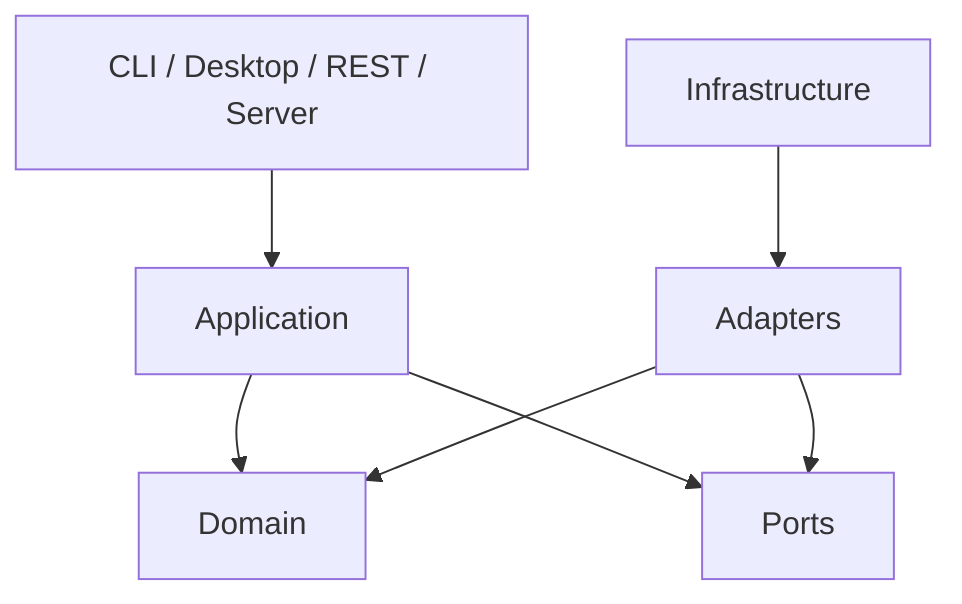

# Orion Architecture

Orion combines Domain-Driven Design, Hexagonal Architecture, Clean Architecture dependency direction, and specification-driven development.

The domain must not import SQLite, Mutagen, FFmpeg, HTTP clients, Typer, or UI frameworks.
