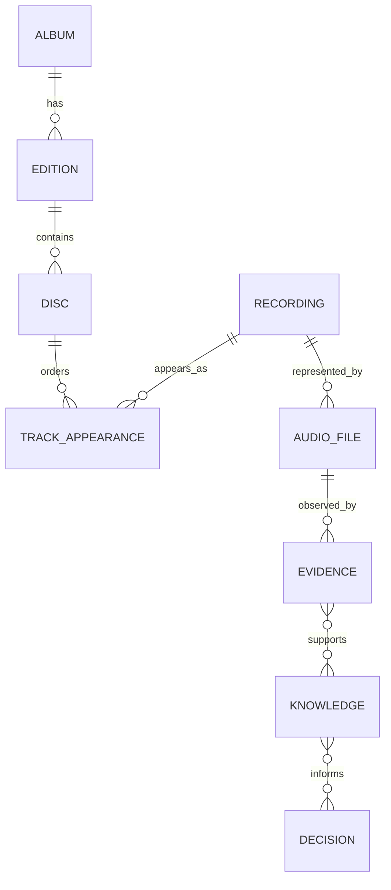

# Domain Model

- **Library** — managed collection and configured roots.
- **Artist** — credited creator or performer.
- **Album** — abstract release concept.
- **Edition** — specific published version.
- **Disc** — physical/logical carrier in an Edition.
- **Recording** — recorded performance independent of release/file.
- **TrackAppearance** — placement of a Recording on a Disc/Edition.
- **AudioFile** — concrete digital representation at a mutable location.
- **Evidence** — observation with provenance.
- **Knowledge** — versioned inferred fact supported by Evidence.
- **Decision** — explainable proposed action derived from Knowledge.

Stable identity must never be derived from a path.

